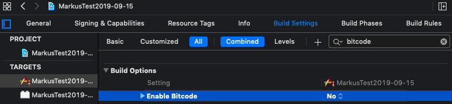

# Install ObjectBox Swift


Having problems installing ObjectBox using this guide?\
Please, [let us know where we lost you](https://objectbox.io/feedback/). Thanks for your help!


ObjectBox Swift is available as a:

* [CocoaPods](install.md#cocoapods) pod
* [Swift Package](install.md#swift-package)

Alternatively, a [manual setup in Xcode](advanced/manual-installation.md) is possible.

## CocoaPods

If you are new to CocoaPods, [check out their website](https://cocoapods.org) for an introduction and installation instructions.

To add the ObjectBox Swift dependency, add the following line to your `Podfile`:

```
pod 'ObjectBox'
```

&#x20;Then install the pod and run the ObjectBox setup script:

```bash
pod install --repo-update
Pods/ObjectBox/setup.rb
```

The `setup.rb` script will configure your Xcode project to run ObjectBox generator on every build by adding a build phase (called `[OBX] Update Sourcery Generated Files`) for every target with an executable.

Disable the **User Script Sandboxing** option to run the ObjectBox generator in recent Xcode versions:

<figure><figcaption><p>Search for "sandbox" in your projects build settings and set User Script Sandboxing to No.</p></figcaption></figure>


The ObjectBox code generator needs to run in the project directory and will generate files there. If this is executed in a sandbox, the build phase will fail.


Then, open your Xcode workspace (.xcworkspace) instead of the Xcode project (.xcodeproj).

Now, you are all set to define your first ObjectBox entities! To continue check the [Getting Started guide](getting-started.md) or [the example project](https://github.com/objectbox/objectbox-swift/tree/main/Example).

### Troubleshoot setup issues

If installing the pod or configuring the project failed, try to update the xcodeproj and cocoapods gem:

```
gem update xcodeproj && gem update cocoapods && pod repo update
```


On Apple Silicon (M1), ensure you have the latest gems for CocoaPods:

```
gem update ffi ethon
```


### Update to a new version

After a new version of ObjectBox Swift is released, update the ObjectBox pod and run the setup script again:

```bash
pod repo update
pod update ObjectBox
Pods/ObjectBox/setup.rb
```

## Swift Package


**The Swift Package is currently in preview**, we [welcome your feedback](https://github.com/objectbox/objectbox-swift/issues/19)!


Instructions depend on whether you want to set up an Xcode project or a Swift Package Manager manifest.

### **Set up an Xcode project**

In Xcode, [add a package dependency](https://developer.apple.com/documentation/xcode/adding-package-dependencies-to-your-app) and search for the package URL:

```
https://github.com/objectbox/objectbox-swift-spm
```

For the Dependency Rule, we recommend to use "Up to Next Major Version" and version `4.3.0-beta.2`. To find the latest version to use view the [tags of the objectbox-swift-spm repository](https://github.com/objectbox/objectbox-swift-spm/tags).

Finally, when asked, add the `ObjectBox.xcframework` to your app target. Or to use [ObjectBox Sync](https://objectbox.io/sync/) (requires access to the Sync feature), add the `ObjectBox-Sync.xcframework` instead.

Now, you are all set to define your first ObjectBox entities. To continue check the [Getting Started guide](getting-started.md) or [the example project](https://github.com/objectbox/objectbox-swift/tree/main/Example).

### **Set up a Swift Package Manager manifest**

In your `Swift.package` file, add the ObjectBox Swift Package repository to the `dependencies` block:

```swift
.package(url: "https://github.com/objectbox/objectbox-swift-spm.git", from: "4.3.0-beta.2"),
```

Add the `ObjectBox.xcframework` to the `dependencies` of the desired target in `targets`:

```swift
.product(name: "ObjectBox.xcframework", package: "objectbox-swift-spm")
```

Or to use [ObjectBox Sync](https://objectbox.io/sync/) (requires access to the Sync feature), add the `ObjectBox-Sync.xcframework` instead:

```swift
.product(name: "ObjectBox-Sync.xcframework", package: "objectbox-swift-spm")
```

Your `Swift.package` file should then contain sections similar to this:

```swift
dependencies: [
    .package(url: "https://github.com/objectbox/objectbox-swift-spm.git", from: "<version>"),
],
targets: [
  .executableTarget(
    name: "YourApp",
    dependencies: [
        .product(name: "ObjectBox.xcframework", package: "objectbox-swift-spm")
    ],
]
```

Now, you are all set to define your first ObjectBox entities! To continue check the [Getting Started guide](getting-started.md) or [the example project](https://github.com/objectbox/objectbox-swift/tree/main/Example).

## Recommended Xcode project settings

#### Disable Bitcode

Some versions of ObjectBox do not include Bitcode and thus you may need to adjust "Build Settings" in Xcode accordingly. In that tab, ensure "All" is active and search for "bitcode". You will find the "Enable Bitcode" setting which you set to "No".



Otherwise, for some build targets, you will get a build error like this:\
`'.../ObjectBox.framework/ObjectBox' does not contain bitcode. You must rebuild it with bitcode enabled (Xcode setting ENABLE_BITCODE), obtain an updated library from the vendor, or disable bitcode for this target.`
